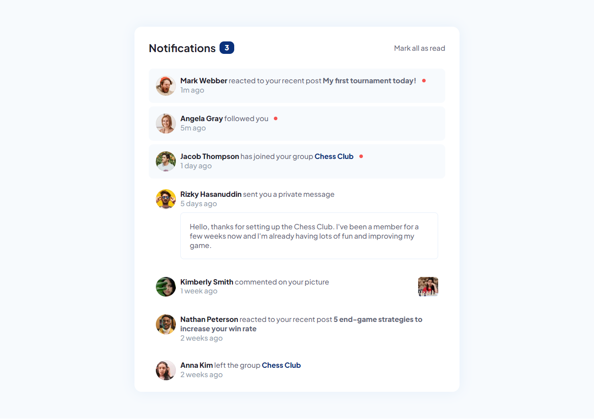

# Frontend Mentor - Notifications page solution

This is a solution to the [Notifications page challenge on Frontend Mentor](https://www.frontendmentor.io/challenges/notifications-page-DqK5QAmKbC). Frontend Mentor challenges help you improve your coding skills by building realistic projects.

## Table of contents

- [Overview](#overview)
  - [The challenge](#the-challenge)
  - [Screenshot](#screenshot)
  - [Links](#links)
- [My process](#my-process)
  - [Built with](#built-with)
  - [What I learned](#what-i-learned)
  - [Useful resources](#useful-resources)
- [Author](#author)

## Overview

### The challenge

Users should be able to:

- Distinguish between "unread" and "read" notifications
- Select "Mark all as read" to toggle the visual state of the unread notifications and set the number of unread messages to zero
- View the optimal layout for the interface depending on their device's screen size
- See hover and focus states for all interactive elements on the page

### Screenshot



### Links

- Solution URL: [https://github.com/saakarx/notifications-page](https://github.com/saakarx/notifications-page)
- Live Site URL: [https://notifications-page-bynl-saakar.vercel.app/](https://notifications-page-bynl-saakar.vercel.app/)

## My process

### Built with

- Semantic HTML5 markup
- CSS custom properties
- Flexbox
- CSS Grid
- Mobile-first workflow

### What I learned

For using variable fonts.

```css
@supports (font-variation-settings: normal) {
  @font-face {
    /* font code */
  }
}
```

### Useful resources

- [Variable Fonts](https://css-tricks.com/newsletter/259-how-to-use-variable-fonts/) - I didn't knew how to use variable fonts this helped me getting to use variable fonts.

## Author

- Frontend Mentor - [@saakarx](https://www.frontendmentor.io/profile/saakarx)
- Twitter - [@SaakarX](https://www.twitter.com/SaakarX)
